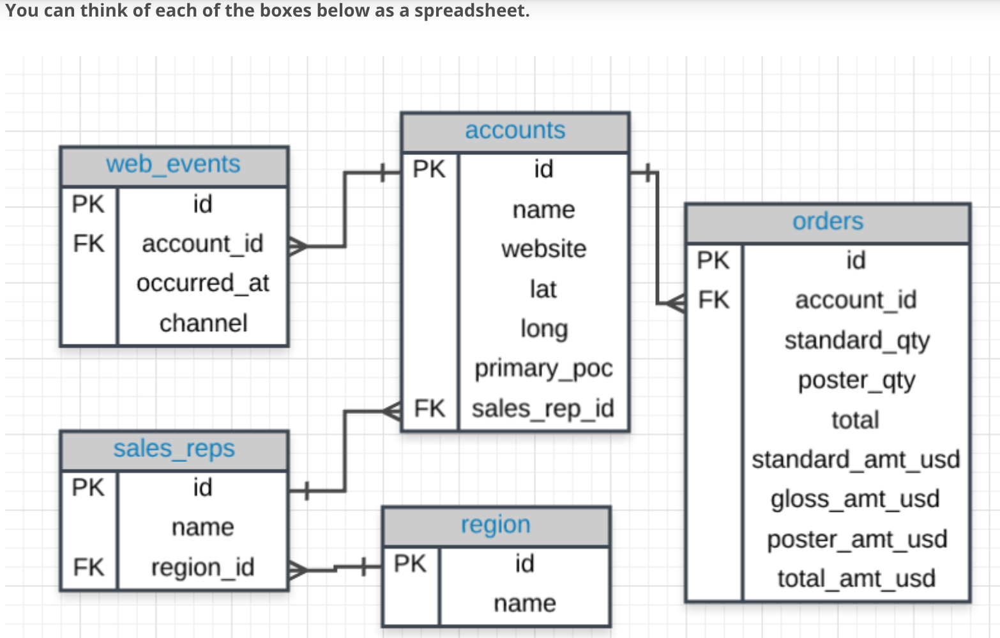
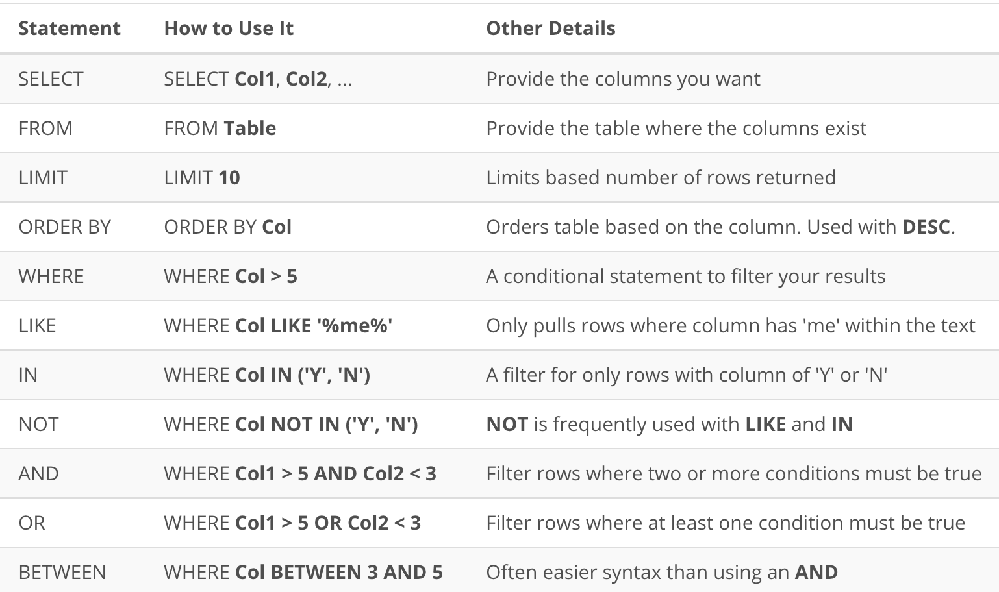
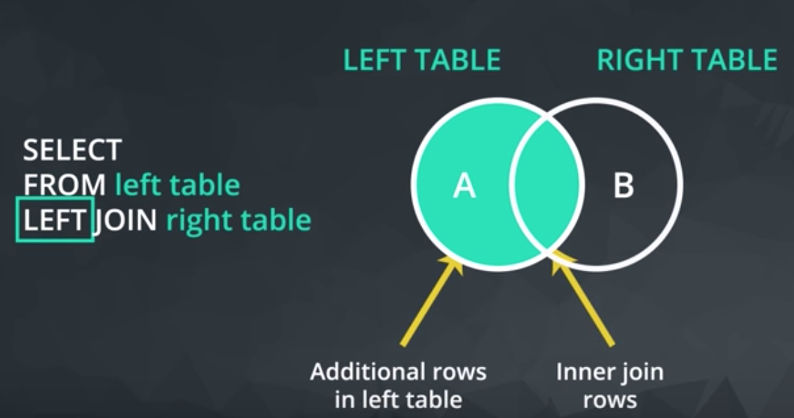
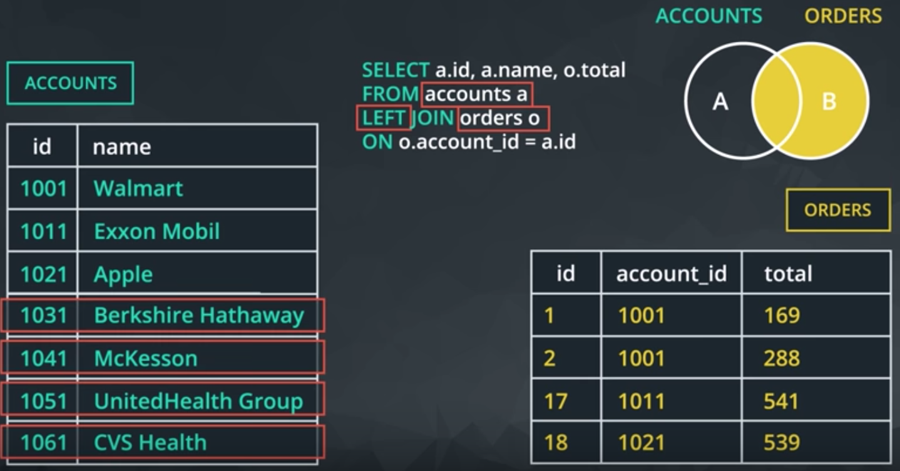
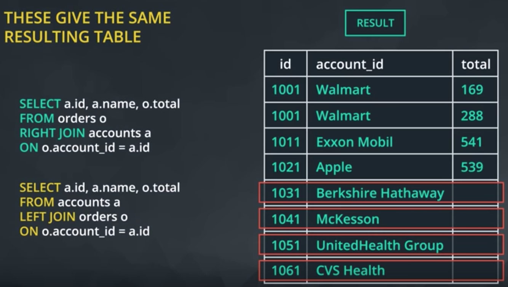

## Entity relationship diagrams
The "crow's foot" that connects the tables together shows us how the columns in one table relate to the columns in another table. 

## Types Of Statements
 A few statements include:
* CREATE TABLE is a statement that creates a new table in a database.
* DROP TABLE is a statement that removes a table in a database.
* SELECT allows you to read data and display it. This is called a query.

## SELECT & FROM Statements
Here you were introduced to two statements that will be used in every query you write
* SELECT - what columns you want back.
* FROM - what table you are querying from. 
```{sql}
SELECT id, account_id, occurred_at
FROM orders;
```

## LIMIT Statement
 The LIMIT statement is useful when you want to see just the first few rows of a table. This can be much faster for loading than if we load the entire dataset.
The LIMIT command is always the very last part of a query. An example of showing just the first 10 rows of the orders table with all of the columns might look like the following:
```{sql}
SELECT *
FROM orders
LIMIT 10
```

## ORDER BY Statement
* The ORDER BY statement allows us to order our table by any row. 
* Remember DESC can be added after the column in your ORDER BY statement to sort in descending order, as the default is to sort in ascending order.
```{sql}
SELECT id, occurred_at, total_amt_usd
FROM orders
ORDER BY occurred_at
LIMIT 10;
```

We can ORDER BY more than one column at a time. The statement sorts according to columns listed from left first and those listed on the right after that.
```{sql}
SELECT *
FROM orders
ORDER BY occurred_at, total_amt_usd
LIMIT 10;
```

## WHERE Statements
Using the **WHERE** statement, we can subset out tables based on conditions that must be met.
```{sql}
SELECT *
FROM orders
WHERE gloss_amt_usd >= 1000
LIMIT 5;
```

The WHERE statement can also be used with non-numerical data. We can use the = and != operators here. You also need to be sure to use single quotes
```{sql}
SELECT name, website, primary_poc
FROM accounts
WHERE name = 'Exxon Mobil';
```

## Arithmetic Operators
### Derived Columns
Creating a new column that is a combination of existing columns is known as a derived column.
### Order of Operations
Remember BOMDAS from maths class? The same order of operations apply when using arithmetic operators in SQL.
```{sql}
SELECT id, account_id, 
       poster_amt_usd/(standard_amt_usd + gloss_amt_usd + poster_amt_usd) AS post_per
FROM orders;
```
### Introduction to Logical Operators

**LIKE** - This allows you to perform operations similar to using WHERE and =, but for cases when you might not know exactly what you are looking for.  The LIKE operator is frequently used with %. The % tells us that we might want any number of characters leading up to a particular set of characters or following a certain set of characters.
```{sql}
/* select all the companies whose names start with 'C' */
SELECT name 
FROM accounts
WHERE name like 'C%'

/* select All companies whose names contain the string 'one' somewhere in the name. */
SELECT name
FROM accounts
WHERE name LIKE '%one%';
```

**IN** - This allows you to perform operations similar to using WHERE and =, but for more than one condition.  We can check one, two or many column values for which we want to pull data, but all within the same query. 
TIP - In most SQL environments, you can use single or double quotation marks - and you may NEED to use double quotation marks if you have an apostrophe within the text you are attempting to pull.
```{sql}
SELECT name, primary_poc, sales_rep_id
FROM accounts
WHERE name IN ('Walmart', 'Target', 'Nordstrom');
```
**NOT** - This is used with IN and LIKE to select all of the rows NOT LIKE or NOT IN a certain condition.
```{sql}
/* Use the accounts table to find the account name, primary poc, and sales rep id for all stores except Walmart, Target, and Nordstrom */
SELECT name, primary_poc, sales_rep_id
FROM accounts
WHERE name NOT IN ('Walmart', 'Target', 'Nordstrom');
```

**AND** & **BETWEEN** - These allow you to combine operations where all combined conditions must be true.
* The AND operator is used within a WHERE statement to consider more than one logical clause at a time. Each time you link a new statement with an AND, you will need to specify the column you are interested in looking at.
* Sometimes we can make a cleaner statement using BETWEEN than we can using AND. Particularly this is true when we are using the same column for different parts of our AND statement. e.g.:
```{sql}
/*Instead of writing : WHERE column >= 6 AND column <= 10 we can instead write*/ 
WHERE column BETWEEN 6 AND 10
```

```{sql}
/* Write a query that returns all the orders where the standard_qty is over 1000, the poster_qty is 0, and the gloss_qty is 0 */
SELECT *
FROM orders
WHERE standard_qty > 1000 AND poster_qty = 0 AND gloss_qty = 0;

/* Using the accounts table find all the companies whose names do not start with 'C' and end with 's' */
SELECT name
FROM accounts
WHERE name NOT LIKE 'C%' AND name LIKE '%s';

/* Use the web_events table to find all information regarding individuals who were contacted via organic or adwords and started their account at any point in 2016 sorted from newest to oldest */ 
SELECT *
FROM web_events
WHERE channel IN ('organic', 'adwords') AND occurred_at BETWEEN '2016-01-01' AND '2017-01-01'
ORDER BY occurred_at DESC;
/*  You will notice that using BETWEEN is tricky for dates! While BETWEEN is generally inclusive of endpoints, it assumes the time is at 00:00:00 (i.e. midnight) for dates. This is the reason why we set the right-side endpoint of the period at '2017-01-01'. */
```

**OR** - This allow you to combine operations where at least one of the combined conditions must be true.
Similar to the AND operator, the OR operator can combine multiple statements. Each time you link a new statement with an OR, you will need to specify the column you are interested in looking at.
```{sql}
/* Find list of orders ids where either gloss_qty or poster_qty is greater than 4000. Only include the id field in the resulting table. */
SELECT id
FROM orders
WHERE gloss_qty > 4000 OR poster_qty > 4000;

/* Write a query that returns a list of orders where the standard_qty is zero and either the gloss_qty or poster_qty is over 1000. */
SELECT *
FROM orders
WHERE standard_qty = 0 AND (gloss_qty > 1000 OR poster_qty > 1000);

/* Find all the company names that start with a 'C' or 'W', and the primary contact contains 'ana' or 'Ana', but it doesn't contain 'eana'*/
SELECT *
FROM accounts
WHERE (name LIKE 'C%' OR name LIKE 'W%') 
           AND ((primary_poc LIKE '%ana%' OR primary_poc LIKE '%Ana%') 
           AND primary_poc NOT LIKE '%eana%');
```

## Summary of basic comands:


***

# JOINS
## Inner joins 
Only return rows that appear in **both tables**
 
e.g. Using ERD: Pull standard_qty, gloss_qty, and poster_qty from the orders table, and the website and the primary_poc from the accounts table.
```{sql}
SELECT orders.standard_qty, orders.gloss_qty, 
       orders.poster_qty,  accounts.website, 
       accounts.primary_poc
FROM orders
JOIN accounts
ON orders.account_id = accounts.id
```
Notice that we need to specify every table a column comes from in the SELECT statement.
### ALIAS
When we JOIN tables together, it is nice to give each table an alias. Frequently an alias is just the first letter of the table name. 
```{sql}
FROM tablename t1 
JOIN tablename2 t2
```

### Questions
1. Provide a table for all *web_events* associated with account name of *Walmart*. There should be three columns. Be sure to include the primary_poc, time of the event, and the channel for each event. Additionally, you might choose to add a fourth column to assure only Walmart events were chosen. 
```{sql}
SELECT a.primary_poc, w.occurred_at, w.channel, a.name
FROM web_events w
JOIN accounts a
ON w.account_id = a.id
WHERE a.name = 'Walmart';
```

2. Provide a table that provides the *region* for each *sales_rep* along with their associated *accounts*. Your final table should include three columns: the region *name*, the sales rep *name*, and the account *name*. Sort the accounts alphabetically (A-Z) according to account name. 
```{sql}
SELECT r.name region, s.name rep, a.name account
FROM sales_reps s
JOIN region r
ON s.region_id = r.id
JOIN accounts a
ON a.sales_rep_id = s.id
ORDER BY a.name;
```

3. Provide the *name* for each region for every *order*, as well as the account *name* and the *unit price* they paid (total_amt_usd/total) for the order. Your final table should have 3 columns: *region name, account name, and unit price*. A few accounts have 0 for *total*, so  divide by (total + 0.01) to assure not dividing by zero.
```{sql}
SELECT r.name region, a.name account, 
       o.total_amt_usd/(o.total + 0.01) unit_price
FROM region r
JOIN sales_reps s
ON s.region_id = r.id
JOIN accounts a
ON a.sales_rep_id = s.id
JOIN orders o
ON o.account_id = a.id;
```

## Outer joins
If we want to include data that only exists in one of the tables we want to join we can use an outer join
 
If there is not matching information in the JOINed table, then you will have columns with empty cells with a data type called NULL.
Writing a LEFT join statement:
 
 
Comparing LEFT and RIGHT join:
 
LEFT and RIGHT joins are essentially inter changeable so its standard to *just use  LEFT joins.*

## JOINS and filtering
If you wanted to filter your results so that it only showed sales from a particular sales rep you could use WHERE but it’s **better to use AND as part of the ON statement.**
A simple rule to remember this is that, when the database executes this query, it executes the join and everything in the ON clause first. Think of this as building the new result set. That result set is then filtered using the WHERE clause.
```{sql}
SELECT orders.*, 
accounts.*
FROM orders
LEFT JOIN accounts
ON orders.account_id = accounts.id
/* Use AND in stead of WHERE for filtering this LEFT JOIN */
AND accounts.sales_rep_id = 325 
```

### Questions
1. Provide a table that provides the region for each sales_rep along with their associated accounts. This time only for the Midwest region. Your final table should include three columns: *the region name, the sales rep name, and the account name*. Sort the accounts alphabetically (A-Z) according to account name.
```{sql}
SELECT r.name region, s.name rep, a.name account
FROM sales_reps s
JOIN region r
ON s.region_id = r.id
JOIN accounts a
ON a.sales_rep_id = s.id
WHERE r.name = 'Midwest'
ORDER BY a.name;
```

2. Provide a table that provides the region for each sales_rep along with their associated accounts. This time only for accounts where the sales rep has a first name starting with S and in the Midwest region. Your final table should include three columns: the region name, the sales rep name, and the account name. Sort the accounts alphabetically (A-Z) according to account name. 
```{sql}
SELECT r.name region, s.name rep, a.name account
FROM sales_reps s
JOIN region r
ON s.region_id = r.id
JOIN accounts a
ON a.sales_rep_id = s.id
WHERE r.name = 'Midwest' AND s.name LIKE 'S%'
ORDER BY a.name;
```

3. Provide a table that provides the region for each sales_rep along with their associated accounts. This time only for accounts where the sales rep has a last name starting with K and in the Midwest region. Your final table should include three columns: the region name, the sales rep name, and the account name. Sort the accounts alphabetically (A-Z) according to account name.
```{sql}
SELECT r.name region, s.name rep, a.name account
FROM sales_reps s
JOIN region r
ON s.region_id = r.id
JOIN accounts a
ON a.sales_rep_id = s.id
WHERE r.name = 'Midwest' AND s.name LIKE '% K%'
ORDER BY a.name;
```

4. Provide the name for each region for every order, as well as the account name and the unit price they paid (total_amt_usd/total) for the order. However, you should only provide the results if the standard order quantity exceeds 100. Your final table should have 3 columns: region name, account name, and unit price. In order to avoid a division by zero error, adding .01 to the denominator here is helpful total_amt_usd/(total+0.01). 
```{sql}
SELECT r.name region, a.name account, o.total_amt_usd/(o.total + 0.01) unit_price
FROM region r
JOIN sales_reps s
ON s.region_id = r.id
JOIN accounts a
ON a.sales_rep_id = s.id
JOIN orders o
ON o.account_id = a.id
WHERE o.standard_qty > 100;
```

5. Provide the name for each region for every order, as well as the account name and the unit price they paid (total_amt_usd/total) for the order. However, you should only provide the results if the standard order quantity exceeds 100 and the poster order quantity exceeds 50. Your final table should have 3 columns: region name, account name, and unit price. Sort for the smallest unit price first. In order to avoid a division by zero error, adding .01 to the denominator here is helpful (total_amt_usd/(total+0.01). 
```{sql}
SELECT r.name region, a.name account, o.total_amt_usd/(o.total + 0.01) unit_price
FROM region r
JOIN sales_reps s
ON s.region_id = r.id
JOIN accounts a
ON a.sales_rep_id = s.id
JOIN orders o
ON o.account_id = a.id
WHERE o.standard_qty > 100 AND o.poster_qty > 50
ORDER BY unit_price;
```

6. Provide the name for each region for every order, as well as the account name and the unit price they paid (total_amt_usd/total) for the order. However, you should only provide the results if the standard order quantity exceeds 100 and the poster order quantity exceeds 50. Your final table should have 3 columns: region name, account name, and unit price. Sort for the largest unit price first. In order to avoid a division by zero error, adding .01 to the denominator here is helpful (total_amt_usd/(total+0.01). 
```{sql}
SELECT r.name region, a.name account, o.total_amt_usd/(o.total + 0.01) unit_price
FROM region r
JOIN sales_reps s
ON s.region_id = r.id
JOIN accounts a
ON a.sales_rep_id = s.id
JOIN orders o
ON o.account_id = a.id
WHERE o.standard_qty > 100 AND o.poster_qty > 50
ORDER BY unit_price DESC;
```

7. What are the different channels used by account id 1001? Your final table should have only 2 columns: account name and the different channels. You can try SELECT DISTINCT to narrow down the results to only the unique values.
```{sql}
SELECT DISTINCT a.name, w.channel
FROM accounts a
RIGHT JOIN web_events w
ON a.id = w.account_id
WHERE a.id = '1001';
```

8. Find all the orders that occurred in 2015. Your final table should have 4 columns: occurred_at, account name, order total, and order total_amt_usd. 
```{sql}
SELECT o.occurred_at, a.name, o.total, o.total_amt_usd
FROM accounts a
JOIN orders o
ON o.account_id = a.id
WHERE o.occurred_at BETWEEN '01-01-2015' AND '01-01-2016'
ORDER BY o.occurred_at DESC;
```

***

# AGGREGATIONS

## Null values
When identifying NULLs in a WHERE clause, we write IS NULL or IS NOT NULL. We don't use =, because NULL isn't considered a value in SQL.

## COUNT
Count the number of rows in a table
```{sql}
SELECT COUNT(*)
FROM accounts;
```
COUNT *does not* consider rows that have *NULL* values. Therefore, this can be useful for quickly identifying which rows have missing data.

## SUM
Unlike COUNT, you can only use SUM on numeric columns. However, SUM will ignore NULL values and treat them as 0.

### Questions
1. Find the total amount of poster_qty paper ordered in the orders table.
```{sql}
SELECT SUM(poster_qty) AS total_poster_sales
FROM orders;
```

2. Find the total amount of standard_qty paper ordered in the orders table.
```{sql}
SELECT SUM(standard_qty) AS total_standard_sales
FROM orders;
```

3. Find the total dollar amount of sales using the total_amt_usd in the orders table.
```{sql}
SELECT SUM(total_amt_usd) AS total_dollar_sales
FROM orders;
```

4. Find the total amount spent on standard_amt_usd and gloss_amt_usd paper for each order in the orders table. This should give a dollar amount for each order in the table.
*Notice, this solution did not use an aggregate.*
```{sql}
SELECT standard_amt_usd + gloss_amt_usd AS total_standard_gloss
FROM orders;
```

5. Find the standard_amt_usd per unit of standard_qty paper. Your solution should use both an aggregation and a mathematical operator. 
*Notice, this solution used both an aggregate and our mathematical operators*
```{sql}
SELECT SUM(standard_amt_usd)/SUM(standard_qty) AS standard_price_per_unit
FROM orders;
```

## MIN and MAX
MIN and MAX are aggregators that *ignore NULL* values.
Functionally, MIN and MAX are similar to COUNT in that they can be used on non-numerical columns. Depending on the column type, MIN will return the lowest number, earliest date, or non-numerical value as early in the alphabet as possible. As you might suspect, MAX does the opposite—it returns the highest number, the latest date, or the non-numerical value closest alphabetically to “Z.”

### Questions
1. When was the earliest order ever placed?
```{sql}
SELECT MIN(occurred_at) 
FROM orders;
```
Try performing the same query as in question 1 without using an aggregation function. 
```{sql}
SELECT occurred_at 
FROM orders 
ORDER BY occurred_at
LIMIT 1;
```

2. When did the most recent (latest) web_event occur?
```{sql}
SELECT MAX(occurred_at)
FROM web_events;
```
Try to perform the result of the previous query without using an aggregation function.
```{sql}
SELECT occurred_at
FROM web_events
ORDER BY occurred_at DESC
LIMIT 1;
```

## AVG
AVG returns the mean of the data - that is the sum of all of the values in the column divided by the number of values in a column.
This aggregate function *ignores the NULL* values in both the numerator and the denominator.

### Questions
1. Find the mean (AVERAGE) amount spent per order on each paper type, as well as the mean amount of each paper type purchased per order. Your final answer should have 6 values - one for each paper type for the average number of sales, as well as the average amount.
```{sql}
SELECT AVG(standard_qty) mean_standard, AVG(gloss_qty) mean_gloss, 
           AVG(poster_qty) mean_poster, AVG(standard_amt_usd) mean_standard_usd, 
           AVG(gloss_amt_usd) mean_gloss_usd, AVG(poster_amt_usd) mean_poster_usd
FROM orders;
```

2. What is the MEDIAN total_usd spent on all orders? Note, this is more advanced than the topics we have covered thus far to build a general solution, but we can hard code a solution in the following way.
``` {sql}
SELECT *
FROM (SELECT total_amt_usd
      FROM orders
      ORDER BY total_amt_usd
      LIMIT 3457) AS Table1
ORDER BY total_amt_usd DESC
LIMIT 2;
```
Since there are 6912 orders - we want the average of the 3457 and 3456 order amounts when ordered. This is the average of 2483.16 and 2482.55. This gives the median of 2482.855. This obviously isn't an ideal way to compute. If we obtain new orders, we would have to change the limit. SQL didn't even calculate the median for us. The above used a SUBQUERY, but you could use any method to find the two necessary values, and then you just need the average of them.

## GROUP BY
GROUP BY can be used to aggregate data within subsets of the data. For example, grouping for different accounts, different regions, or different sales representatives.
Any column in the SELECT statement that is not within an aggregator must be in the GROUP BY clause.
The GROUP BY always goes between WHERE and ORDER BY.
ORDER BY works like SORT in spreadsheet software.
SQL evaluates the aggregations before the LIMIT clause. If you don’t group by any columns, you’ll get a 1-row result—no problem there. If you group by a column with enough unique values that it exceeds the LIMIT number, the aggregates will be calculated, and then some rows will simply be omitted from the results.
This is a nice way to do things because you know you’re going to get the correct aggregates. If SQL cuts the table down to 100 rows, then performed the aggregations, your results would be substantially different.

Note: You can reference the columns in your select statement in GROUP BY and ORDER BY clauses with numbers that follow the order they appear in the select statement. For example
```{sql}
SELECT standard_qty, COUNT(*)

FROM orders

GROUP BY 1 /*(this 1 refers to standard_qty since it is the first of the columns included in the select statement)*/

ORDER BY 1 /*(this 1 refers to standard_qty since it is the first of the columns included in the select statement)*/
```

### Questions
1. Which account (by name) placed the earliest order? Your solution should have the account name and the date of the order.
```{sql}
SELECT a.name, o.occurred_at
FROM accounts a
JOIN orders o
ON a.id = o.account_id
ORDER BY occurred_at
LIMIT 1;
```

2. Find the total sales in usd for each account. You should include two columns - the total sales for each company's orders in usd and the company name.
```{sql}
SELECT a.name, SUM(total_amt_usd) total_sales
FROM orders o
JOIN accounts a
ON a.id = o.account_id
GROUP BY a.name;
```

3. Via what channel did the most recent (latest) web_event occur, which account was associated with this web_event? Your query should return only three values - the date, channel, and account name.
```{sql}
SELECT w.occurred_at, w.channel, a.name
FROM web_events w
JOIN accounts a
ON w.account_id = a.id 
ORDER BY w.occurred_at DESC
LIMIT 1;
```

4. Find the total number of times each type of channel from the web_events was used. Your final table should have two columns - the channel and the number of times the channel was used.
```{sql}
SELECT w.channel, COUNT(*)
FROM web_events w
GROUP BY w.channel
```

5. Who was the primary contact associated with the earliest web_event?
```{sql}
SELECT a.primary_poc
FROM web_events w
JOIN accounts a
ON a.id = w.account_id
ORDER BY w.occurred_at
LIMIT 1;
```

6. What was the smallest order placed by each account in terms of total usd. Provide only two columns - the account name and the total usd. Order from smallest dollar amounts to largest.
```{sql} 
SELECT a.name, MIN(total_amt_usd) smallest_order
FROM accounts a
JOIN orders o
ON a.id = o.account_id
GROUP BY a.name
ORDER BY smallest_order;
```
Sort of strange we have a bunch of orders with no dollars. We might want to look into those. 

7. Find the number of sales reps in each region. Your final table should have two columns - the region and the number of sales_reps. Order from fewest reps to most reps.
```{sql}
SELECT r.name, COUNT(*) num_reps
FROM region r
JOIN sales_reps s
ON r.id = s.region_id
GROUP BY r.name
ORDER BY num_reps;
```

You can GROUP BY multiple columns at once. This is often useful to aggregate across a number of different segments. 
The order of columns listed in the *ORDER BY* clause does make a difference. You are ordering the columns from left to right.
The order of column names in your *GROUP BY* clause doesn’t matter—the results will be the same regardless.

### Questions
1. For each account, determine the average amount of each type of paper they purchased across their orders. Your result should have four columns - one for the account name and one for the average spent on each of the paper types.
```{sql}
SELECT a.name, AVG(o.standard_qty) avg_stand, AVG(o.gloss_qty) avg_gloss, AVG(o.poster_qty) avg_post
FROM accounts a
JOIN orders o
ON a.id = o.account_id
GROUP BY a.name;
```

2. For each account, determine the average amount spent per order on each paper type. Your result should have four columns - one for the account name and one for the average amount spent on each paper type.
```{sql}
SELECT a.name, AVG(o.standard_amt_usd) avg_stand, AVG(o.gloss_amt_usd) avg_gloss, AVG(o.poster_amt_usd) avg_post
FROM accounts a
JOIN orders o
ON a.id = o.account_id
GROUP BY a.name;
```

3. Determine the number of times a particular channel was used in the web_events table for each sales rep. Your final table should have three columns - the name of the sales rep, the channel, and the number of occurrences. Order your table with the highest number of occurrences first.
```{sql}
SELECT s.name, w.channel, COUNT(*) num_events
FROM accounts a
JOIN web_events w
ON a.id = w.account_id
JOIN sales_reps s
ON s.id = a.sales_rep_id
GROUP BY s.name, w.channel
ORDER BY num_events DESC;
```

4. Determine the number of times a particular channel was used in the web_events table for each region. Your final table should have three columns - the region name, the channel, and the number of occurrences. Order your table with the highest number of occurrences first.
```{sql}
SELECT r.name, w.channel, COUNT(*) num_events
FROM accounts a
JOIN web_events w
ON a.id = w.account_id
JOIN sales_reps s
ON s.id = a.sales_rep_id
JOIN region r
ON r.id = s.region_id
GROUP BY r.name, w.channel
ORDER BY num_events DESC;
```

## DISTINCT 
DISTINCT is always used in SELECT statements, and it provides the unique rows for all columns written in the SELECT statement. Therefore, you only use DISTINCT once in any particular SELECT statement.
```{sql}
SELECT DISTINCT column1, column2, column3
FROM table1;
```
which would return the unique (or DISTINCT) rows across all three columns.
Note: using DISTINCT, particularly in aggregations, can slow your queries down quite a bit.

### Questions
1. Use DISTINCT to test if there are any accounts associated with more than one region.

The below two queries have the same number of resulting rows (351), so we know that every account is associated with only one region. If each account was associated with more than one region, the first query should have returned more rows than the second query.
```{sql}
SELECT a.id as "account id", r.id as "region id", 
a.name as "account name", r.name as "region name"
FROM accounts a
JOIN sales_reps s
ON s.id = a.sales_rep_id
JOIN region r
ON r.id = s.region_id;
```
and
```{sql}
SELECT DISTINCT id, name
FROM accounts;
```
2. Have any sales reps worked on more than one account?

Actually all of the sales reps have worked on more than one account. The fewest number of accounts any sales rep works on is 3. There are 50 sales reps, and they all have more than one account. Using DISTINCT in the second query assures that all of the sales reps are accounted for in the first query.
```{sql}
SELECT s.id, s.name, COUNT(*) num_accounts
FROM accounts a
JOIN sales_reps s
ON s.id = a.sales_rep_id
GROUP BY s.id, s.name
ORDER BY num_accounts;
```

```{sql}
SELECT DISTINCT id, name
FROM sales_reps;
```

## HAVING
HAVING is the “clean” way to filter a query that has been aggregated, but this is also commonly done using a subquery. Essentially, any time you want to perform a WHERE on an element of your query that was created by an aggregate, you need to use HAVING instead.
HAVING appears after the GROUP BY clause but before the ORDER BY clause.

### Questions
1. How many of the sales reps have more than 5 accounts that they manage?
```{sql}
SELECT s.id, s.name, COUNT(*) num_accounts
FROM accounts a
JOIN sales_reps s
ON s.id = a.sales_rep_id
GROUP BY s.id, s.name
HAVING COUNT(*) > 5
ORDER BY num_accounts;
```

2. How many accounts have more than 20 orders?
```{sql}
SELECT a.id, a.name, COUNT(*) num_orders
FROM accounts a
JOIN orders o
ON a.id = o.account_id
GROUP BY a.id, a.name
HAVING COUNT(*) > 20
ORDER BY num_orders;
```

3. Which account has the most orders?
```{sql}
SELECT a.id, a.name, COUNT(*) num_orders
FROM accounts a
JOIN orders o
ON a.id = o.account_id
GROUP BY a.id, a.name
ORDER BY num_orders DESC
LIMIT 1;
```

4. How many accounts spent more than 30,000 usd total across all orders?
```{sql}
SELECT a.id, a.name, SUM(o.total_amt_usd) total_spent
FROM accounts a
JOIN orders o
ON a.id = o.account_id
GROUP BY a.id, a.name
HAVING SUM(o.total_amt_usd) > 30000
ORDER BY total_spent;
```

5. How many accounts spent less than 1,000 usd total across all orders?
```{sql}
SELECT a.id, a.name, SUM(o.total_amt_usd) total_spent
FROM accounts a
JOIN orders o
ON a.id = o.account_id
GROUP BY a.id, a.name
HAVING SUM(o.total_amt_usd) < 1000
ORDER BY total_spent;
```

6. Which account has spent the most with us?
```{sql}
SELECT a.id, a.name, SUM(o.total_amt_usd) total_spent
FROM accounts a
JOIN orders o
ON a.id = o.account_id
GROUP BY a.id, a.name
ORDER BY total_spent DESC
LIMIT 1;
```

7. Which account has spent the least with us?
```{sql}
SELECT a.id, a.name, SUM(o.total_amt_usd) total_spent
FROM accounts a
JOIN orders o
ON a.id = o.account_id
GROUP BY a.id, a.name
ORDER BY total_spent
LIMIT 1;
```

8. Which accounts used facebook as a channel to contact customers more than 6 times?
```{sql}
SELECT a.id, a.name, w.channel, COUNT(*) use_of_channel
FROM accounts a
JOIN web_events w
ON a.id = w.account_id
GROUP BY a.id, a.name, w.channel
HAVING COUNT(*) > 6 AND w.channel = 'facebook'
ORDER BY use_of_channel;
```

9. Which account used facebook most as a channel? 
```{sql}
SELECT a.id, a.name, w.channel, COUNT(*) use_of_channel
FROM accounts a
JOIN web_events w
ON a.id = w.account_id
WHERE w.channel = 'facebook'
GROUP BY a.id, a.name, w.channel
ORDER BY use_of_channel DESC
LIMIT 1;
```

10. Which channel was most frequently used by most accounts?
```{sql}
SELECT a.id, a.name, w.channel, COUNT(*) use_of_channel
FROM accounts a
JOIN web_events w
ON a.id = w.account_id
GROUP BY a.id, a.name, w.channel
ORDER BY use_of_channel DESC
LIMIT 10;
```

## DATE Functions
*GROUP*ing *BY* a date column is not usually very useful in SQL, as these columns tend to have transaction data down to a second. 
Dates are stored in year, month, day, hour, minute, second, which helps us in truncating.
There are a number of built in SQL functions that are aimed at helping us improve our experience in working with dates:
In SQL dates are stored in the format YYYY-MM-DD with the time in hours, minutes and seconds at the end. 
*DATE_TRUNC* allows you to truncate your date to a particular part of your date-time column. Common trunctions are day, month, and year.
*DATE_PART* can be useful for pulling a specific portion of a date, but notice pulling month or day of the week (dow) means that you are no longer keeping the years in order. Rather you are grouping for certain components regardless of which year they belonged in.
*Note:* DOW (day of week) returns a value from 0-6 where 0 is Sunday and 6 is Saturday. 

### Questions
1. Find the sales in terms of total dollars for all orders in each *year*, ordered from greatest to least. Do you notice any trends in the yearly sales totals?
```{sql}
SELECT DATE_PART('year', occurred_at) ord_year,  SUM(total_amt_usd) total_spent
FROM orders
GROUP BY 1
ORDER BY 2 DESC;
```
When we look at the yearly totals, you might notice that 2013 and 2017 have much smaller totals than all other years. If we look further at the monthly data, we see that for 2013 and 2017 there is only one month of sales for each of these years (12 for 2013 and 1 for 2017). Therefore, neither of these are evenly represented. Sales have been increasing year over year, with 2016 being the largest sales to date. At this rate, we might expect 2017 to have the largest sales.

2. Which *month* did Parch & Posey have the greatest sales in terms of total dollars? Are all months evenly represented by the dataset?

In order for this to be 'fair', we should remove the sales from 2013 and 2017. For the same reasons as discussed above.
```{sql}
SELECT DATE_PART('month', occurred_at) ord_month, SUM(total_amt_usd) total_spent
FROM orders
WHERE occurred_at BETWEEN '2014-01-01' AND '2017-01-01'
GROUP BY 1
ORDER BY 2 DESC;
```
The greatest sales amounts occur in December (12).

3. Which *year* did Parch & Posey have the greatest sales in terms of total number of orders? Are all years evenly represented by the dataset?
```{sql}
SELECT DATE_PART('year', occurred_at) ord_year,  COUNT(*) total_sales
FROM orders
GROUP BY 1
ORDER BY 2 DESC;
```
Again, 2016 by far has the most amount of orders, but again 2013 and 2017 are not evenly represented to the other years in the dataset.

4. Which *month* did Parch & Posey have the greatest sales in terms of total number of orders? Are all months evenly represented by the dataset?
```{sql}
SELECT DATE_PART('month', occurred_at) ord_month, COUNT(*) total_sales
FROM orders
WHERE occurred_at BETWEEN '2014-01-01' AND '2017-01-01'
GROUP BY 1
ORDER BY 2 DESC;
```
December still has the most sales, but interestingly, November has the second most sales (but not the most dollar sales. To make a fair comparison from one month to another 2017 and 2013 data were removed.

5. In which month of which year did Walmart spend the most on gloss paper in terms of dollars?
```{sql}
SELECT DATE_TRUNC('month', o.occurred_at) ord_date, SUM(o.gloss_amt_usd) tot_spent
FROM orders o 
JOIN accounts a
ON a.id = o.account_id
WHERE a.name = 'Walmart'
GROUP BY 1
ORDER BY 2 DESC
LIMIT 1;
```
May 2016 was when Walmart spent the most on gloss paper.

## CASE 
The CASE statement always goes in the SELECT clause.
CASE must include the following components: WHEN, THEN, and END. ELSE is an optional component to catch cases that didn’t meet any of the other previous CASE conditions.
You can make any conditional statement using any conditional operator (like WHERE) between WHEN and THEN. This includes stringing together multiple conditional statements using AND and OR.
You can include multiple WHEN statements, as well as an ELSE statement again, to deal with any unaddressed conditions.
### Example
In a quiz question in the previous Basic SQL lesson, you saw this question:
1. Create a column that divides the standard_amt_usd by the standard_qty to find the unit price for standard paper for each order. Limit the results to the first 10 orders, and include the id and account_id fields. *NOTE - you will be thrown an error with the correct solution to this question. This is for a division by zero. You will learn how to get a solution without an error to this query when you learn about CASE statements in a later section.*
Let's see how we can use the CASE statement to get around this error.
```{sql}
SELECT id, account_id, standard_amt_usd/standard_qty AS unit_price
FROM orders
LIMIT 10;
```
Now, let's use a CASE statement. This way any time the standard_qty is zero, we will return 0, and otherwise we will return the unit_price.
```{sql}
SELECT account_id, CASE WHEN standard_qty = 0 OR standard_qty IS NULL THEN 0
                        ELSE standard_amt_usd/standard_qty END AS unit_price
FROM orders
LIMIT 10;
```
Now the first part of the statement will catch any of those division by zero values that were causing the error, and the other components will compute the division as necessary. You will notice, we essentially charge all of our accounts 4.99 for standard paper. It makes sense this doesn't fluctuate, and it is more accurate than adding 1 in the denominator like our quick fix might have been in the earlier lesson.

### Questions
1. We would like to understand 3 different levels of customers based on the amount associated with their purchases. The top branch includes anyone with a Lifetime Value (total sales of all orders) greater than 200,000 usd. The second branch is between 200,000 and 100,000 usd. The lowest branch is anyone under 100,000 usd. Provide a table that includes the level associated with each account. You should provide the account name, the total sales of all orders for the customer, and the level. Order with the top spending customers listed first.
```{sql}
SELECT a.name, SUM(total_amt_usd) total_spent, 
     CASE WHEN SUM(total_amt_usd) > 200000 THEN 'top'
     WHEN  SUM(total_amt_usd) > 100000 THEN 'middle'
     ELSE 'low' END AS customer_level
FROM orders o
JOIN accounts a
ON o.account_id = a.id 
GROUP BY a.name
ORDER BY 2 DESC;
```

2. We would now like to perform a similar calculation to the first, but we want to obtain the total amount spent by customers only in 2016 and 2017. Keep the same levels as in the previous question. Order with the top spending customers listed first.
```{sql}
SELECT a.name, SUM(total_amt_usd) total_spent, 
     CASE WHEN SUM(total_amt_usd) > 200000 THEN 'top'
     WHEN  SUM(total_amt_usd) > 100000 THEN 'middle'
     ELSE 'low' END AS customer_level
FROM orders o
JOIN accounts a
ON o.account_id = a.id
WHERE occurred_at > '2015-12-31' 
GROUP BY 1
ORDER BY 2 DESC;
```

3. We would like to identify top performing sales reps, which are sales reps associated with more than 200 orders. Create a table with the sales rep name, the total number of orders, and a column with top or not depending on if they have more than 200 orders. Place the top sales people first in your final table.
```{sql}
SELECT s.name, COUNT(*) num_ords,
     CASE WHEN COUNT(*) > 200 THEN 'top'
     ELSE 'not' END AS sales_rep_level
FROM orders o
JOIN accounts a
ON o.account_id = a.id 
JOIN sales_reps s
ON s.id = a.sales_rep_id
GROUP BY s.name
ORDER BY 2 DESC;
```
It is worth mentioning that this assumes each name is unique - which has been done a few times. We otherwise would want to break by the name and the id of the table.

4. The previous didn't account for the middle, nor the dollar amount associated with the sales. Management decides they want to see these characteristics represented as well. We would like to identify top performing sales reps, which are sales reps associated with more than 200 orders or more than 750000 in total sales. The middle group has any rep with more than 150 orders or 500000 in sales. Create a table with the sales rep name, the total number of orders, total sales across all orders, and a column with top, middle, or low depending on this criteria. Place the top sales people based on dollar amount of sales first in your final table. You might see a few upset sales people by this criteria!
```{sql}
SELECT s.name, COUNT(*), SUM(o.total_amt_usd) total_spent, 
     CASE WHEN COUNT(*) > 200 OR SUM(o.total_amt_usd) > 750000 THEN 'top'
     WHEN COUNT(*) > 150 OR SUM(o.total_amt_usd) > 500000 THEN 'middle'
     ELSE 'low' END AS sales_rep_level
FROM orders o
JOIN accounts a
ON o.account_id = a.id 
JOIN sales_reps s
ON s.id = a.sales_rep_id
GROUP BY s.name
ORDER BY 3 DESC;
```

***

# Subqueries
Whenever we need to use existing tables to create a new table that we then want to query again, this is an indication that we will need to use some sort of *subquery*.

e.g.Find the average number of events that occur for each day for each channel:
(i) First, we needed to group by the day and channel. Then ordering by the number of events (the third column) gave us a quick way to answer the first question.
```{sql}
SELECT DATE_TRUNC('day',occurred_at) AS day,
   channel, COUNT(*) as events
FROM web_events
GROUP BY 1,2
ORDER BY 3 DESC;
```
(ii)Here you can see that to get the entire table in question 1 back, we included an * in our SELECT statement. You will need to be sure to alias your table.
```{sql}
SELECT *
FROM (SELECT DATE_TRUNC('day',occurred_at) AS day,
           channel, COUNT(*) as events
     FROM web_events 
     GROUP BY 1,2
     ORDER BY 3 DESC) sub;
```
(iii) Finally, here we are able to get a table that shows the average number of events a day for each channel.. Since you broke out by day in inner query, this is giving you an average per day.
```{sql}
SELECT channel, AVG(events) AS average_events
FROM (SELECT DATE_TRUNC('day',occurred_at) AS day,
             channel, COUNT(*) as events
      FROM web_events 
      GROUP BY 1,2) sub
GROUP BY channel
ORDER BY 2 DESC;
```
*Format subqueries using indents in order to make it easier to read*

## Subqueries Part II
In the first subquery you wrote, you created a table that you could then query again in the FROM statement. However, if you are only returning a single value, you might use that value in a logical statement like WHERE, HAVING, or even SELECT - the value could be nested within a CASE statement. It can be used anyehwre you might have a table name, or a column name or individual value.
*Note* that you should not include an alias when you write a subquery in a conditional statement. This is because the subquery is treated as an individual value (or set of values in the IN case) rather than as a table.

e.g. Return the average quantity of each type of paper that was sold in the same moth as Parch & Poseys first order ever. 
(i)To get the date of the first order you could write a subquery with a min function. 
```{sql}
SELECT DATE_TRUNC('month', MIN(occurred_at)) 
FROM orders;
```
(ii)Then to pull the average for each, we could do this all in one query, but for readability, I provided two queries below to perform each separately.
```{sql}
SELECT AVG(standard_qty) avg_std, AVG(gloss_qty) avg_gls, AVG(poster_qty) avg_pst
FROM orders
WHERE DATE_TRUNC('month', occurred_at) = 
     (SELECT DATE_TRUNC('month', MIN(occurred_at)) FROM orders);

SELECT SUM(total_amt_usd)
FROM orders
WHERE DATE_TRUNC('month', occurred_at) = 
      (SELECT DATE_TRUNC('month', MIN(occurred_at)) FROM orders);
```
Also, notice the query here compared a single value. Most conditional logic will work with subqueries containing one cell results. IN is the only type of conditional logic that will work when the inner query contains multiple results. If we returned an entire column IN would need to be used to perform a logical argument. If we are returning an entire table, then we must use an ALIAS for the table, and perform additional logic on the entire table.

### Questions
1. Provide the name of the sales_rep in each region with the largest amount of total_amt_usd sales.
First, I wanted to find the total_amt_usd totals associated with each sales rep, and I also wanted the region in which they were located. The query below provided this information.
```{sql}
SELECT s.name rep_name, r.name region_name, SUM(o.total_amt_usd) total_amt
FROM sales_reps s
JOIN accounts a
ON a.sales_rep_id = s.id
JOIN orders o
ON o.account_id = a.id
JOIN region r
ON r.id = s.region_id
GROUP BY 1,2
ORDER BY 3 DESC;
```
Next, I pulled the max for each region, and then we can use this to pull those rows in our final result.
```{sql}
SELECT region_name, MAX(total_amt) total_amt
     FROM(SELECT s.name rep_name, r.name region_name, SUM(o.total_amt_usd) total_amt
             FROM sales_reps s
             JOIN accounts a
             ON a.sales_rep_id = s.id
             JOIN orders o
             ON o.account_id = a.id
             JOIN region r
             ON r.id = s.region_id
             GROUP BY 1, 2) t1
     GROUP BY 1;
```
Essentially, this is a JOIN of these two tables, where the region and amount match.
```{sql}
SELECT t3.rep_name, t3.region_name, t3.total_amt
FROM(SELECT region_name, MAX(total_amt) total_amt
     FROM(SELECT s.name rep_name, r.name region_name, SUM(o.total_amt_usd) total_amt
             FROM sales_reps s
             JOIN accounts a
             ON a.sales_rep_id = s.id
             JOIN orders o
             ON o.account_id = a.id
             JOIN region r
             ON r.id = s.region_id
             GROUP BY 1, 2) t1
     GROUP BY 1) t2
JOIN (SELECT s.name rep_name, r.name region_name, SUM(o.total_amt_usd) total_amt
     FROM sales_reps s
     JOIN accounts a
     ON a.sales_rep_id = s.id
     JOIN orders o
     ON o.account_id = a.id
     JOIN region r
     ON r.id = s.region_id
     GROUP BY 1,2
     ORDER BY 3 DESC) t3
ON t3.region_name = t2.region_name AND t3.total_amt = t2.total_amt;
```

2.For the region with the largest sales total_amt_usd, how many total orders were placed? 
The first query I wrote was to pull the total_amt_usd for each region.
```{sql}
SELECT r.name region_name, SUM(o.total_amt_usd) total_amt
FROM sales_reps s
JOIN accounts a
ON a.sales_rep_id = s.id
JOIN orders o
ON o.account_id = a.id
JOIN region r
ON r.id = s.region_id
GROUP BY r.name;
```
Then we just want the region with the max amount from this table. There are two ways I considered getting this amount. One was to pull the max using a subquery. Another way is to order descending and just pull the top value.
```{sql}
SELECT MAX(total_amt)
FROM (SELECT r.name region_name, SUM(o.total_amt_usd) total_amt
             FROM sales_reps s
             JOIN accounts a
             ON a.sales_rep_id = s.id
             JOIN orders o
             ON o.account_id = a.id
             JOIN region r
             ON r.id = s.region_id
             GROUP BY r.name) sub;
```
Finally, we want to pull the total orders for the region with this amount:
```{sql}
SELECT r.name, SUM(o.total) total_orders
FROM sales_reps s
JOIN accounts a
ON a.sales_rep_id = s.id
JOIN orders o
ON o.account_id = a.id
JOIN region r
ON r.id = s.region_id
GROUP BY r.name
HAVING SUM(o.total_amt_usd) = (
      SELECT MAX(total_amt)
      FROM (SELECT r.name region_name, SUM(o.total_amt_usd) total_amt
              FROM sales_reps s
              JOIN accounts a
              ON a.sales_rep_id = s.id
              JOIN orders o
              ON o.account_id = a.id
              JOIN region r
              ON r.id = s.region_id
              GROUP BY r.name) sub);
```
3. For the name of the account that purchased the most (in total over their lifetime as a customer) standard_qty paper, how many accounts still had more in total purchases? 
First, we want to find the account that had the most standard_qty paper. The query here pulls that account, as well as the total amount:
```{sql}
SELECT a.name account_name, SUM(o.standard_qty) total_std, SUM(o.total) total
FROM accounts a
JOIN orders o
ON o.account_id = a.id
GROUP BY 1
ORDER BY 2 DESC
LIMIT 1;
```
Now, I want to use this to pull all the accounts with more total sales:
```{sql}
SELECT a.name
FROM orders o
JOIN accounts a
ON a.id = o.account_id
GROUP BY 1
HAVING SUM(o.total) > (SELECT total 
                  FROM (SELECT a.name act_name, SUM(o.standard_qty) tot_std, SUM(o.total) total
                        FROM accounts a
                        JOIN orders o
                        ON o.account_id = a.id
                        GROUP BY 1
                        ORDER BY 2 DESC
                        LIMIT 1) sub);
```
This is now a list of all the accounts with more total orders. We can get the count with just another simple subquery.
```{sql}
SELECT COUNT(*)
FROM (SELECT a.name
      FROM orders o
      JOIN accounts a
      ON a.id = o.account_id
      GROUP BY 1
      HAVING SUM(o.total) > (SELECT total 
                  FROM (SELECT a.name act_name, SUM(o.standard_qty) tot_std, SUM(o.total) total
                        FROM accounts a
                        JOIN orders o
                        ON o.account_id = a.id
                        GROUP BY 1
                        ORDER BY 2 DESC
                        LIMIT 1) inner_tab)
            ) counter_tab;
```
4. For the customer that spent the most (in total over their lifetime as a customer) total_amt_usd, how many web_events did they have for each channel?
Here, we first want to pull the customer with the most spent in lifetime value.
```{sql}
SELECT a.id, a.name, SUM(o.total_amt_usd) tot_spent
FROM orders o
JOIN accounts a
ON a.id = o.account_id
GROUP BY a.id, a.name
ORDER BY 3 DESC
LIMIT 1;
```
Now, we want to look at the number of events on each channel this company had, which we can match with just the id.
```{sql}
SELECT a.name, w.channel, COUNT(*)
FROM accounts a
JOIN web_events w
ON a.id = w.account_id AND a.id =  (SELECT id
                     FROM (SELECT a.id, a.name, SUM(o.total_amt_usd) tot_spent
                           FROM orders o
                           JOIN accounts a
                           ON a.id = o.account_id
                           GROUP BY a.id, a.name
                           ORDER BY 3 DESC
                           LIMIT 1) inner_table)
GROUP BY 1, 2
ORDER BY 3 DESC;
```
I added an ORDER BY for no real reason, and the account name to assure I was only pulling from one account.
5. What is the lifetime average amount spent in terms of total_amt_usd for the top 10 total spending accounts?
First, we just want to find the top 10 accounts in terms of highest total_amt_usd.
```{sql}
SELECT a.id, a.name, SUM(o.total_amt_usd) tot_spent
FROM orders o
JOIN accounts a
ON a.id = o.account_id
GROUP BY a.id, a.name
ORDER BY 3 DESC
LIMIT 10;
```
Now, we just want the average of these 10 amounts.
```{sql}
SELECT AVG(tot_spent)
FROM (SELECT a.id, a.name, SUM(o.total_amt_usd) tot_spent
      FROM orders o
      JOIN accounts a
      ON a.id = o.account_id
      GROUP BY a.id, a.name
      ORDER BY 3 DESC
       LIMIT 10) temp;
```
6. What is the lifetime average amount spent in terms of total_amt_usd for only the companies that spent more than the average of all orders.
First, we want to pull the average of all accounts in terms of total_amt_usd:
```{sql}
SELECT AVG(o.total_amt_usd) avg_all
FROM orders o
JOIN accounts a
ON a.id = o.account_id;
```
Then, we want to only pull the accounts with more than this average amount.
```{sql}
SELECT o.account_id, AVG(o.total_amt_usd)
FROM orders o
GROUP BY 1
HAVING AVG(o.total_amt_usd) > (SELECT AVG(o.total_amt_usd) avg_all
                               FROM orders o
                               JOIN accounts a
                               ON a.id = o.account_id);
```
Finally, we just want the average of these values.
```{sql}
SELECT AVG(avg_amt)
FROM (SELECT o.account_id, AVG(o.total_amt_usd) avg_amt
    FROM orders o
    GROUP BY 1
    HAVING AVG(o.total_amt_usd) > (SELECT AVG(o.total_amt_usd) avg_all
                               FROM orders o
                               JOIN accounts a
                               ON a.id = o.account_id)) temp_table;
```

***

# WITH
The WITH statement is often called a Common Table Expression or CTE. Though these expressions serve the exact same purpose as subqueries, they are more common in practice, as they tend to be cleaner for a future reader to follow the logic.
QUESTION: You need to find the average number of events for each channel per day
Using subqueries:
```{sql}
SELECT channel, AVG(events) AS average_events
FROM (SELECT DATE_TRUNC('day',occurred_at) AS day,
             channel, COUNT(*) as events
      FROM web_events 
      GROUP BY 1,2) sub
GROUP BY channel
ORDER BY 2 DESC;
```
Let's try this again using a WITH statement.
Notice, you can pull the inner query:
```{sql}
SELECT DATE_TRUNC('day',occurred_at) AS day, 
       channel, COUNT(*) as events
FROM web_events 
GROUP BY 1,2
```
This is the part we put in the WITH statement. Notice, we are aliasing the table as events below:
```{sql}
WITH events AS (
          SELECT DATE_TRUNC('day',occurred_at) AS day, 
                        channel, COUNT(*) as events
          FROM web_events 
          GROUP BY 1,2)
```
Now, we can use this newly created events table as if it is any other table in our database:
```{sql}
WITH events AS (
          SELECT DATE_TRUNC('day',occurred_at) AS day, 
                        channel, COUNT(*) as events
          FROM web_events 
          GROUP BY 1,2)

SELECT channel, AVG(events) AS average_events
FROM events
GROUP BY channel
ORDER BY 2 DESC;
```
For the above example, we don't need anymore than the one additional table, but imagine we needed to create a second table to pull from. We can create an additional table to pull from in the following way:
```{sql}
WITH table1 AS (
          SELECT *
          FROM web_events),

     table2 AS (
          SELECT *
          FROM accounts)


SELECT *
FROM table1
JOIN table2
ON table1.account_id = table2.id;
```
You can add more and more tables using the WITH statement in the same way.

Essentially a WITH statement performs the same task as a Subquery. Therefore, you can write any of the queries we worked with in the previous set of questions using a WITH. That's what you'll do here. Try to perform each of the earlier queries again, but using a WITH instead of a subquery.

### Questions
1. Provide the name of the sales_rep in each region with the largest amount of total_amt_usd sales.
```{sql}
WITH t1 AS (
  SELECT s.name rep_name, r.name region_name, SUM(o.total_amt_usd) total_amt
   FROM sales_reps s
   JOIN accounts a
   ON a.sales_rep_id = s.id
   JOIN orders o
   ON o.account_id = a.id
   JOIN region r
   ON r.id = s.region_id
   GROUP BY 1,2
   ORDER BY 3 DESC), 
t2 AS (
   SELECT region_name, MAX(total_amt) total_amt
   FROM t1
   GROUP BY 1)
SELECT t1.rep_name, t1.region_name, t1.total_amt
FROM t1
JOIN t2
ON t1.region_name = t2.region_name AND t1.total_amt = t2.total_amt;  
```

2.For the region with the largest sales total_amt_usd, how many total orders were placed? 
```{sql}
WITH t1 AS (
   SELECT r.name region_name, SUM(o.total_amt_usd) total_amt
   FROM sales_reps s
   JOIN accounts a
   ON a.sales_rep_id = s.id
   JOIN orders o
   ON o.account_id = a.id
   JOIN region r
   ON r.id = s.region_id
   GROUP BY r.name), 
t2 AS (
   SELECT MAX(total_amt)
   FROM t1)
SELECT r.name, SUM(o.total) total_orders
FROM sales_reps s
JOIN accounts a
ON a.sales_rep_id = s.id
JOIN orders o
ON o.account_id = a.id
JOIN region r
ON r.id = s.region_id
GROUP BY r.name
HAVING SUM(o.total_amt_usd) = (SELECT * FROM t2);
```

3. For the name of the account that purchased the most (in total over their lifetime as a customer) standard_qty paper, how many accounts still had more in total purchases? 
```{sql}
WITH t1 AS (
  SELECT a.name account_name, SUM(o.standard_qty) total_std, SUM(o.total) total
  FROM accounts a
  JOIN orders o
  ON o.account_id = a.id
  GROUP BY 1
  ORDER BY 2 DESC
  LIMIT 1), 
t2 AS (
  SELECT a.name
  FROM orders o
  JOIN accounts a
  ON a.id = o.account_id
  GROUP BY 1
  HAVING SUM(o.total) > (SELECT total FROM t1))
SELECT COUNT(*)
FROM t2;
```

4. For the customer that spent the most (in total over their lifetime as a customer) total_amt_usd, how many web_events did they have for each channel?
```{sql}
WITH t1 AS (
   SELECT a.id, a.name, SUM(o.total_amt_usd) tot_spent
   FROM orders o
   JOIN accounts a
   ON a.id = o.account_id
   GROUP BY a.id, a.name
   ORDER BY 3 DESC
   LIMIT 1)
SELECT a.name, w.channel, COUNT(*)
FROM accounts a
JOIN web_events w
ON a.id = w.account_id AND a.id =  (SELECT id FROM t1)
GROUP BY 1, 2
ORDER BY 3 DESC;
```

5. What is the lifetime average amount spent in terms of total_amt_usd for the top 10 total spending accounts?
```{sql}
WITH t1 AS (
   SELECT a.id, a.name, SUM(o.total_amt_usd) tot_spent
   FROM orders o
   JOIN accounts a
   ON a.id = o.account_id
   GROUP BY a.id, a.name
   ORDER BY 3 DESC
   LIMIT 10)
SELECT AVG(tot_spent)
FROM t1;
```

6. What is the lifetime average amount spent in terms of total_amt_usd for only the companies that spent more than the average of all orders.
```{sql}
WITH t1 AS (
   SELECT AVG(o.total_amt_usd) avg_all
   FROM orders o
   JOIN accounts a
   ON a.id = o.account_id),
t2 AS (
   SELECT o.account_id, AVG(o.total_amt_usd) avg_amt
   FROM orders o
   GROUP BY 1
   HAVING AVG(o.total_amt_usd) > (SELECT * FROM t1))
SELECT AVG(avg_amt)
FROM t2;
```

***
# SQL Data Cleaning

## LEFT, RIGHT, LENGTH
*LEFT* pulls a specified number of characters for each row in a specified column starting at the beginning (or from the left). For example, you can pull the first three digits of a phone number using LEFT(phone_number, 3).

*RIGHT* pulls a specified number of characters for each row in a specified column starting at the end (or from the right). For example, you can pull the last eight digits of a phone number using RIGHT(phone_number, 8).

*LENGTH* provides the number of characters for each row of a specified column. You could use this to get the length of each phone number as LENGTH(phone_number).

### Questions
1. In the accounts table, there is a column holding the website for each company. The last three digits specify what type of web address they are using. A list of extensions (and pricing) is provided. Pull these extensions and provide how many of each website type exist in the accounts table.
```{sql}
SELECT RIGHT(website, 3) AS domain, COUNT(*) num_companies
FROM accounts
GROUP BY 1
ORDER BY 2 DESC;
```


2. There is much debate about how much the name (or even the first letter of a company name) matters. Use the accounts table to pull the first letter of each company name to see the distribution of company names that begin with each letter (or number). 
```{sql}
SELECT LEFT(UPPER(name), 1) AS first_letter, COUNT(*) num_companies
FROM accounts
GROUP BY 1
ORDER BY 2 DESC;
```

3. Use the accounts table and a CASE statement to create two groups: one group of company names that start with a number and a second group of those company names that start with a letter. What proportion of company names start with a letter?
```{sql}
SELECT SUM(num) nums, SUM(letter) letters
FROM (SELECT name, CASE WHEN LEFT(UPPER(name), 1) IN ('0','1','2','3','4','5','6','7','8','9') 
                       THEN 1 ELSE 0 END AS num, 
         CASE WHEN LEFT(UPPER(name), 1) IN ('0','1','2','3','4','5','6','7','8','9') 
                       THEN 0 ELSE 1 END AS letter
      FROM accounts) t1;
```
There are 350 company names that start with a letter and 1 that starts with a number. This gives a ratio of 350/351 that are company names that start with a letter or 99.7%.

4. Consider vowels as a, e, i, o, and u. What proportion of company names start with a vowel, and what percent start with anything else?
```{sql}
SELECT SUM(vowels) vowels, SUM(other) other
FROM (SELECT name, CASE WHEN LEFT(UPPER(name), 1) IN ('A','E','I','O','U') 
                        THEN 1 ELSE 0 END AS vowels, 
          CASE WHEN LEFT(UPPER(name), 1) IN ('A','E','I','O','U') 
                       THEN 0 ELSE 1 END AS other
         FROM accounts) t1;
```
There are 80 company names that start with a vowel and 271 that start with other characters. Therefore 80/351 are vowels or 22.8%. Therefore, 77.2% of company names do not start with vowels.

## POSITION, STRPOS, LOWER, UPPER
*POSITION* takes a character and a column, and provides the index where that character is for each row. The index of the first position is 1 in SQL. Here, you saw that you can pull the index of a comma as POSITION(',' IN city_state).

*STRPOS* provides the same result as POSITION, but the syntax for achieving those results is a bit different as shown here: STRPOS(city_state, ',').

*Note*, both POSITION and STRPOS are *case sensitive*, so looking for A is different than looking for a. 
Therefore, if you want to pull an index regardless of the case of a letter, you might want to use *LOWER* or *UPPER* to make all of the characters lower or uppercase.

### Questions
1. Use the accounts table to create first and last name columns that hold the first and last names for the primary_poc. 
```{sql}
SELECT LEFT(primary_poc, STRPOS(primary_poc, ' ') -1 ) first_name, 
RIGHT(primary_poc, LENGTH(primary_poc) - STRPOS(primary_poc, ' ')) last_name
FROM accounts;
```
2. Now see if you can do the same thing for every rep name in the sales_rep table. Again provide first and last name columns.
```{sql}
SELECT LEFT(name, STRPOS(name, ' ') -1 ) first_name, 
       RIGHT(name, LENGTH(name) - STRPOS(name, ' ')) last_name
FROM sales_reps;
```

## CONCAT
Each of these will allow you to combine columns together across rows. For example, first and last names stored in separate columns could be combined together to create a full name: CONCAT(first_name, ' ', last_name) or with piping as first_name || ' ' || last_name.

### Questions
1. Each company in the accounts table wants to create an email address for each primary_poc. The email address should be the first name of the primary_poc . last name primary_poc @ company name .com.
```{sql}
WITH t1 AS (
 SELECT LEFT(primary_poc,     STRPOS(primary_poc, ' ') -1 ) first_name,  RIGHT(primary_poc, LENGTH(primary_poc) - STRPOS(primary_poc, ' ')) last_name, name
 FROM accounts)
SELECT first_name, last_name, CONCAT(first_name, '.', last_name, '@', name, '.com')
FROM t1;
```

2.You may have noticed that in the previous solution some of the company names include spaces, which will certainly not work in an email address. See if you can create an email address that will work by removing all of the spaces in the account name, but otherwise your solution should be just as in question 1. Some helpful documentation is here.
```{sql}
WITH t1 AS (
 SELECT LEFT(primary_poc,     STRPOS(primary_poc, ' ') -1 ) first_name,  RIGHT(primary_poc, LENGTH(primary_poc) - STRPOS(primary_poc, ' ')) last_name, name
 FROM accounts)
SELECT first_name, last_name, CONCAT(first_name, '.', last_name, '@', REPLACE(name, ' ', ''), '.com')
FROM  t1;
```

3.We would also like to create an initial password, which they will change after their first log in. The first password will be the first letter of the primary_poc's first name (lowercase), then the last letter of their first name (lowercase), the first letter of their last name (lowercase), the last letter of their last name (lowercase), the number of letters in their first name, the number of letters in their last name, and then the name of the company they are working with, all capitalized with no spaces.
```{sql}
WITH t1 AS (
 SELECT LEFT(primary_poc,     STRPOS(primary_poc, ' ') -1 ) first_name,  RIGHT(primary_poc, LENGTH(primary_poc) - STRPOS(primary_poc, ' ')) last_name, name
 FROM accounts)
SELECT first_name, last_name, CONCAT(first_name, '.', last_name, '@', name, '.com'), LEFT(LOWER(first_name), 1) || RIGHT(LOWER(first_name), 1) || LEFT(LOWER(last_name), 1) || RIGHT(LOWER(last_name), 1) || LENGTH(first_name) || LENGTH(last_name) || REPLACE(UPPER(name), ' ', '')
FROM t1;
```

## CAST
e.g. If you have three seperate columns for day, month and year. We can change the month name to a number and concatenate these three columns with hyphens and tell the database that the result is a date.
```{sql}
SELECT *,
  DATE_PART('month', TO_DATE(month, 'month')) AS clean_month /*Convert month names to numbers */
  year || '-' || DATE_PART('month', TO_DATE(month, 'month')) || '-' || day AS concatenated_date 
  CAST (year || '-' || DATE_PART('month', TO_DATE(month, 'month')) || '-' || day AS date) AS formatted_date
FROM ad_clicks
```
DATE_PART('month', TO_DATE(month, 'month')) here changed a month name into the number associated with that particular month.
Then you can change a string to a date using CAST. CAST is actually useful to change lots of column types. Commonly you might be doing as you saw here, where you change a string to a date using CAST(date_column AS DATE). However, you might want to make other changes to your columns in terms of their data types. 
In this example, instead of CAST(date_column AS DATE), you can use date_column::DATE.

Most of the functions presented in this lesson are specific to strings. They won’t work with dates, integers or floating-point numbers. However, using any of these functions will automatically change the data to the appropriate type.
LEFT, RIGHT, and TRIM are all used to select only certain elements of strings, but using them to select elements of a number or date will treat them as strings for the purpose of the function. Though we didn't cover TRIM in this lesson explicitly, it can be used to remove characters from the beginning and end of a string. This can remove unwanted spaces at the beginning or end of a row that often happen with data being moved from Excel or other storage systems.

### Questions
1. In the given dataset the format of the date column is mm/dd/yyyy with times that are not correct also at the end of the date. Remember dates should be in the format yyyy-mm-dd. Write a query to change the date to the correct SQL date format. Then use either CAST or :: to convert to a date. 
```{sql}
SELECT date orig_date, (SUBSTR(date, 7, 4) || '-' || LEFT(date, 2) || '-' || SUBSTR(date, 4, 2))::DATE new_date
FROM sf_crime_data;
```

## COALESCE
Occassionally you'll end up with a datset that contains some nulls that you'd prefer to have some actual values. For e.g. we may want to label a NULL value in the primary_poc column as "no poc" so the results will be easily understanable. You can use COALESCE to replace the NULL values. 
```{sql}
SELECT *,
  COALESCE(primary_poc, 'no POC') AS primary_poc_modified
FROM accounts
WHERE primary_poc is NULL;
```
In general, COALESCE returns the first non-NULL value passed for each row.
You can use COALESCE to fill NULL values so that you gey values in every cell. This will have an effect on functions such as COUNT

### Questions
1. Use COALSECE to fill in the accounts.id column with the account.id for the NULL value 
```{sql}
SELECT COALESCE(a.id, a.id) filled_id, a.name, a.website, a.lat, a.long, a.primary_poc, a.sales_rep_id, o.*
FROM accounts a
LEFT JOIN orders o
ON a.id = o.account_id
WHERE o.total IS NULL;
```

2. Use COALSECE to fill in the orders.account_id column with the account.id for the NULL value 
```{sql}
SELECT COALESCE(a.id, a.id) filled_id, a.name, a.website, a.lat, a.long, a.primary_poc, a.sales_rep_id, COALESCE(o.account_id, a.id) account_id, o.occurred_at, o.standard_qty, o.gloss_qty, o.poster_qty, o.total, o.standard_amt_usd, o.gloss_amt_usd, o.poster_amt_usd, o.total_amt_usd
FROM accounts a
LEFT JOIN orders o
ON a.id = o.account_id
WHERE o.total IS NULL;
```

3. USE COALESCE to fill in ecah of the qty and usd columns with 0.
```{sql}
SELECT COALESCE(a.id, a.id) filled_id, a.name, a.website, a.lat, a.long, a.primary_poc, a.sales_rep_id, COALESCE(o.account_id, a.id) account_id, o.occurred_at, COALESCE(o.standard_qty, 0) standard_qty, COALESCE(o.gloss_qty,0) gloss_qty, COALESCE(o.poster_qty,0) poster_qty, COALESCE(o.total,0) total, COALESCE(o.standard_amt_usd,0) standard_amt_usd, COALESCE(o.gloss_amt_usd,0) gloss_amt_usd, COALESCE(o.poster_amt_usd,0) poster_amt_usd, COALESCE(o.total_amt_usd,0) total_amt_usd
FROM accounts a
LEFT JOIN orders o
ON a.id = o.account_id
WHERE o.total IS NULL;
```

***
# SQL Window functions
[PostgreSQL’s documentation](https://www.postgresql.org/docs/9.1/static/tutorial-window.html) does an excellent job of introducing the concept of Window Functions: a window function performs a calculation across a set of table rows that are somehow related to the current row. This is comparable to the type of calculation that can be done with an aggregate function. But unlike regular aggregate functions, use of a window function does not cause rows to become grouped into a single output row — the rows retain their separate identities. Behind the scenes, the window function is able to access more than just the current row of the query result.
Through introducing window functions, we have also introduced two statements that you may not be familiar with: OVER and PARTITION BY. These are key to window functions. Not every window function uses PARTITION BY; we can also use ORDER BY or no statement at all depending on the query we want to run.
Note: You can’t use window functions and standard aggregations in the same query. More specifically, you can’t include window functions in a GROUP BY clause.

e.g. If we wanted to get a running total of how much standard paper we've sold to date. 
```{sql}
SELECT standard_qty
    SUM(standard_qty) OVER (ORDER BY occurred_at) AS running_total
  FROM orders
```
This query uses an aggregation without using GROUP BY. 
*OVER* designates the aggregation as a window function. Can read the above as take the sum of standard paper across all rows leading up to a given row in order by occured_at. 

Let's say that instead we wanted to start the running total over at the beginning of each month. To narrow the window from the entire dataset to individual groups within the dataset you use the *PARTITION BY* function. Now this query groups and orders the query by the month the transaction occurred. Within each month it's ordered by occurred_at and the running total sums across that current row and all previous rows of standard quantity.
The ORDER BY treats each partition as seperate. It also creates the running total. Without ORDER BY each value will simply be a sum of all the standard_qty values in its respective month. 
```{sql}
SELECT standard_qty
    DATE_TRUNC('month', occured_at) AS month,
    SUM(standard_qty) OVER (PARTITION BY DATE_TRUNC('month', occured_at) ORDER BY occurred_at) AS running_total
  FROM orders
```

### Questions
1. Create a running total of standard_amt_usd (in the orders table) over order time with no date truncation. Your final table should have two columns: one with the amount being added for each new row, and a second with the running total.
```{sql}
SELECT standard_amt_usd,
       SUM(standard_amt_usd) OVER (ORDER BY occurred_at) AS running_total
FROM orders
```

2.Now, modify your query from the previous quiz to include partitions. Still create a running total of standard_amt_usd (in the orders table) over order time, but this time, date truncate occurred_at by year and partition by that same year-truncated occurred_at variable. Your final table should have three columns: One with the amount being added for each row, one for the truncated date, and a final columns with the running total within each year.
```{sql}
SELECT standard_amt_usd,
       DATE_TRUNC('year', occurred_at) as year,
       SUM(standard_amt_usd) OVER (PARTITION BY DATE_TRUNC('year', occurred_at) ORDER BY occurred_at) AS running_total
FROM orders
```

## ROW_NUMBER & RANK
*ROW_NUMBER()* displays the number of a given row within the window you define. It starts at 1 and and numbers the rows according to the ORDER BY part of the window statement. It doesn't require you to specify a variable within the parentheses. 
Here, we're ordering by the ID field which increments by one every row so the id and row_num fieds always have the same value. 
```{sql}
SELECT id,
        account_id,
        occurred_at,
       ROW_NUMBER() OVER (ORDER BY id) AS row_num
FROM orders
```
If we order by occurred_at the rows are ordered differently and the row_num column is therefore assigned differently. The row_num no longer matches up with ids. 
```{sql}
SELECT id,
        account_id,
        occurred_at,
       ROW_NUMBER() OVER (ORDER BY occurred_at) AS row_num
FROM orders
```
Using a PARTITION BY clause we can start the count over at one again in each partition. Let's partition by account_id. This now shows us the row number within each account_id where row one is the first order that occurred. 
```{sql}
SELECT id,
        account_id,
        occurred_at,
       ROW_NUMBER() OVER (PARTITION BY account_id ORDER BY occurred_at) AS row_num
FROM orders
```

There's another fnction, *RANK()* that does something similar. The results may look the same but there's a subtle difference. If two lines in a row have the same value for occurred_at they're given the same rank, whereas ROW_NUMBER() gives them different numbers.   
```{sql}
SELECT id,
        account_id,
        occurred_at,
       RANK() OVER (PARTITION BY account_id ORDER BY occurred_at) AS row_num
FROM orders
```
You'll notice the differenc if you order by date trunc month. Entries with the same month are now given the same rank and the rank column now skips some values to make up for it. There's a similar function, *DENSE_RANK()* which doesn't skip values after assigning several rows with the same rank. 
```{sql}
SELECT id,
        account_id,
        DATE_TRUNC('month', occurred_at) as month,
       RANK() OVER (PARTITION BY account_id ORDER BY DATE_TRUNC('month', occurred_at)) AS row_num
FROM orders
```

### Questions
Select the id, account_id, and total variable from the orders table, then create a column called total_rank that ranks this total amount of paper ordered (from highest to lowest) for each account using a partition. Your final table should have these four columns.
```{sql}
SELECT id,
       account_id,
       total,
       RANK() OVER (PARTITION BY account_id ORDER BY total DESC) AS total_rank
FROM orders
```

## Aggregates in Window functions
When using window functions you can apply the same aggregates as undernormal circumstances: SUM, COUNT, AVG, MIN and MAX. 

```{sql}
SELECT id,
       account_id,
       standard_qty,
       DATE_TRUNC('month', occurred_at) AS month,
       DENSE_RANK() OVER (PARTITION BY account_id ORDER BY DATE_TRUNC('month',occurred_at)) AS dense_rank,
       SUM(standard_qty) OVER (PARTITION BY account_id ORDER BY DATE_TRUNC('month',occurred_at)) AS sum_std_qty,
       COUNT(standard_qty) OVER (PARTITION BY account_id ORDER BY DATE_TRUNC('month',occurred_at)) AS count_std_qty,
       AVG(standard_qty) OVER (PARTITION BY account_id ORDER BY DATE_TRUNC('month',occurred_at)) AS avg_std_qty,
       MIN(standard_qty) OVER (PARTITION BY account_id ORDER BY DATE_TRUNC('month',occurred_at)) AS min_std_qty,
       MAX(standard_qty) OVER (PARTITION BY account_id ORDER BY DATE_TRUNC('month',occurred_at)) AS max_std_qty
FROM orders
```
If you were to remove ORDER BY DATE_TRUNC('month',occurred_at) n each line of the query that contains it in:
The ORDER BY clause is one of two clauses integral to window functions. The ORDER and PARTITION define what is referred to as the “window”—the ordered subset of data over which calculations are made. Removing ORDER BY just leaves an unordered partition; in our query's case, each column's value is simply an aggregation (e.g. sum, count, average, minimum, or maximum) of all the standard_qty values in its respective account_id.

## Aliases for multiple windows
If you're planning to write several window functions in the same query using the same window you can create an alias. Using the previous code snippet we'll define the alias using a *WINDOW* clause which would normall y go between the WHERE clause and the GROUP BY clause. Since this query has neither of those we'll put this after FROM. 
```{sql}
SELECT id,
       account_id,
       standard_qty,
       DATE_TRUNC('month', occurred_at) AS month,
       DENSE_RANK() OVER main_window AS dense_rank,
       SUM(standard_qty) OVER main_window AS sum_std_qty,
       COUNT(standard_qty) OVER main_window AS count_std_qty,
       AVG(standard_qty) OVER main_window AS avg_std_qty,
       MIN(standard_qty) OVER main_window AS min_std_qty,
       MAX(standard_qty) OVER main_window AS max_std_qty
FROM orders
WINDOW main_window AS (PARTITION BY account_id ORDER BY DATE_TRUNC('month',occurred_at))
```

### Questions
Create and use an alias to shorten the following query that has multiple window functions. Name the alias account_year_window, which is more descriptive than main_window in the example above.
```{sql}
SELECT id,
       account_id,
       DATE_TRUNC('year',occurred_at) AS year,
       DENSE_RANK() OVER (PARTITION BY account_id ORDER BY DATE_TRUNC('year',occurred_at)) AS dense_rank,
       total_amt_usd,
       SUM(total_amt_usd) OVER (PARTITION BY account_id ORDER BY DATE_TRUNC('year',occurred_at)) AS sum_total_amt_usd,
       COUNT(total_amt_usd) OVER (PARTITION BY account_id ORDER BY DATE_TRUNC('year',occurred_at)) AS count_total_amt_usd,
       AVG(total_amt_usd) OVER (PARTITION BY account_id ORDER BY DATE_TRUNC('year',occurred_at)) AS avg_total_amt_usd,
       MIN(total_amt_usd) OVER (PARTITION BY account_id ORDER BY DATE_TRUNC('year',occurred_at)) AS min_total_amt_usd,
       MAX(total_amt_usd) OVER (PARTITION BY account_id ORDER BY DATE_TRUNC('year',occurred_at)) AS max_total_amt_usd
FROM orders
```
Using an alias this would be:
```{sql}
SELECT id,
       account_id,
       DATE_TRUNC('year',occurred_at) AS year,
       DENSE_RANK() OVER account_year_window AS dense_rank,
       total_amt_usd,
       SUM(total_amt_usd) OVER account_year_window AS sum_total_amt_usd,
       COUNT(total_amt_usd) OVER account_year_window AS count_total_amt_usd,
       AVG(total_amt_usd) OVER account_year_window AS avg_total_amt_usd,
       MIN(total_amt_usd) OVER account_year_window AS min_total_amt_usd,
       MAX(total_amt_usd) OVER account_year_window AS max_total_amt_usd
FROM orders 
WINDOW account_year_window AS (PARTITION BY account_id ORDER BY DATE_TRUNC('year',occurred_at))
```

## Comparing a row to previous row
*LAG* pulls from the previous row and *LEAD* pulls from the next row. When using LAG if there are no previous rows then you'll get NULL. 
e.g. You want to determine how the current order's total revenue (i.e. from sales of all types of paper) revenue compares to the next order's total revenue.
```{sql}
SELECT occurred_at,
       total_amt_usd,
       LEAD(total_amt_usd) OVER (ORDER BY occurred_at) AS lead,
       LEAD(total_amt_usd) OVER (ORDER BY occurred_at) - total_amt_usd AS lead_difference
FROM (
SELECT occurred_at,
       SUM(total_amt_usd) AS total_amt_usd
  FROM orders 
 GROUP BY 1
) sub
```

## Introduction to percentiles
You can use window functions to identify what percentile (or quartile, or any other subdivision) a given row falls into. The syntax is NTILE(*# of buckets*). In this case, ORDER BY determines which column to use to determine the quartiles (or whatever number of ‘tiles you specify).
In cases with relatively few rows in a window, the NTILE function doesn’t calculate exactly as you might expect. For example, If you only had two records and you were measuring percentiles, you’d expect one record to define the 1st percentile, and the other record to define the 100th percentile. Using the NTILE function, what you’d actually see is one record in the 1st percentile, and one in the 2nd percentile. If you’re working with very small windows, keep this in mind and consider using quartiles or similarly small bands.

### Questions
You can use partitions with percentiles to determine the percentile of a specific subset of all rows. Imagine you're an analyst at Parch & Posey and you want to determine the largest orders (in terms of quantity) a specific customer has made to encourage them to order more similarly sized large orders. You only want to consider the NTILE for that customer's account_id.
1. Use the NTILE functionality to divide the accounts into 4 levels in terms of the amount of standard_qty for their orders. Your resulting table should have the account_id, the occurred_at time for each order, the total amount of standard_qty paper purchased, and one of four levels in a standard_quartile column.
```{sql}
SELECT id,
       account_id,
       occurred_at,
       standard_qty,
       NTILE(4) OVER (PARTITION BY account_id ORDER BY standard_qty) AS standard_quartile,
  FROM orders 
 ORDER BY account_id DESC
```

2. Use the NTILE functionality to divide the accounts into two levels in terms of the amount of gloss_qty for their orders. Your resulting table should have the account_id, the occurred_at time for each order, the total amount of gloss_qty paper purchased, and one of two levels in a gloss_half column.
```{sql}
SELECT id,
       account_id,
       occurred_at,
       gloss_qty,
       NTILE(2) OVER (PARTITION BY account_id ORDER BY gloss_qty) AS gloss_half,
  FROM orders 
 ORDER BY account_id DESC
```

3. Use the NTILE functionality to divide the accounts into 100 levels in terms of the amount of total_amt_usd for their orders. Your resulting table should have the account_id, the occurred_at time for each order, the total amount of total_amt_usd paper purchased, and one of 100 levels in a total_percentile column.
```{sql}
SELECT id,
       account_id,
       occurred_at,
       total_amt_usd,
       NTILE(100) OVER (PARTITION BY account_id ORDER BY total_amt_usd) AS total_percentile
  FROM orders 
 ORDER BY account_id DESC
```

***

